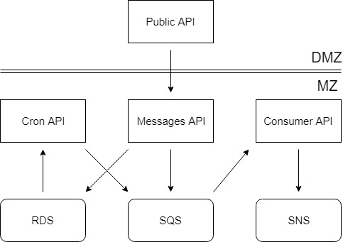

# NSMono

## Notification Service

## About

Allows you to send smart notifications to all your SNS topic subscribers.

You can send two types of messages:

Instant messages: just a message.
Smart messages: messages with cron job pattern.

## Application diagram

## License
MIT

## Author
Matheus Freire Rabelo
